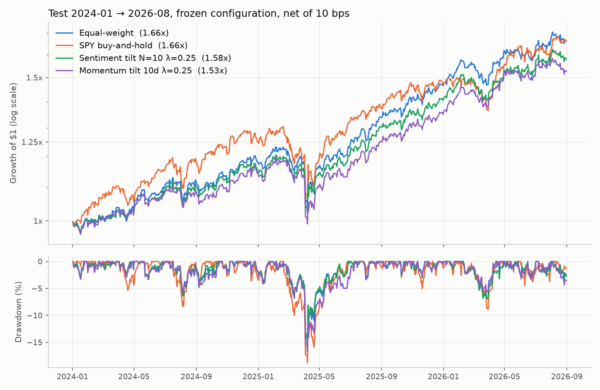

# Sentiment-Driven Portfolio

A weekly-rebalanced portfolio of 9 large US stocks whose weights tilt with a daily news-sentiment
signal (FinBERT on headlines). The goal is to learn financial NLP and portfolio construction with
rigor, not to beat the market: no look-ahead, a temporal train/validation/test split, baselines with
transaction costs and honest statistics.

Status: complete. The test period was opened once (tag `pre-test-freeze`). **Result: the
sentiment tilt does not beat equal weight; there is no evidence that headline sentiment predicts
the cross-section of these 9 stocks' weekly returns.** See [PLAN.md](PLAN.md) for the full plan
(in Spanish).

## Results

All numbers are net of 10 bps per dollar traded; Sharpe is over the 3-month T-bill.

**Signal (train 2016–2021).** Mean daily cross-sectional IC (Spearman) against forward returns is
about 0 and slightly negative for every window and horizon (best: -0.05, t = -2.7, the best of 18
correlated tests). Against *past* returns it is strongly positive (+0.09 to +0.17, t = 5 to 8):
headlines mostly describe what the price already did.

**Strategy selection (train) and validation (2022–2023).** All 9 grid points lose to equal weight
on train (IR -0.84 to -1.18); the least bad, N = 10 and λ = 0.25, was frozen. On validation it
beat equal weight (IR +0.68, ΔSharpe +0.09 with 95% CI [-0.09, +0.28]). The phase-6 gate (train IC
with t > 2 *and* a validation edge) failed, so no reinforcement-learning agent was trained.

**Test (2024-01 to 2026-08), frozen configuration, run once:**

| | Ann. return | Volatility | Sharpe | Max drawdown | Turnover/yr | IR vs EW |
|---|---|---|---|---|---|---|
| Equal weight | 21.1% | 13.0% | 1.21 | -15.5% | 0.67 | — |
| SPY buy-and-hold | 21.1% | 15.7% | 1.03 | -18.8% | 0.00 | +0.04 |
| **Sentiment tilt** (N=10, λ=0.25) | 18.9% | 13.1% | 1.06 | -15.0% | 3.96 | -0.98 |
| Momentum tilt (control) | 17.3% | 12.8% | 0.97 | -16.8% | 4.65 | -1.40 |

- Sharpe of the tilt minus Sharpe of equal weight: **-0.15**, block-bootstrap 95% CI [-0.34, +0.02].
- Paired test on the daily active return: -1.9% per year, t = -1.64.
- Placebo (signal shuffled across tickers, 200 draws): p = 0.66. The real signal does no better
  than a random one with the same turnover.
- Signal IC on test (h = 5): -0.013, 95% CI [-0.063, +0.037].
- Even with zero costs the tilt loses (IR -0.64): costs make it worse, but they are not the cause.



The validation edge did not survive: it was noise, as the train results suggested. A contrarian
tilt (reversed sign, tried as an exploratory check after seeing the train IC) would have been a
data-snooping trap: positive on train, negative on validation.

## What this does NOT show

- **Not that news sentiment is useless.** It shows that *this* signal — FinBERT on Benzinga
  headlines, averaged over days, for 9 mega-caps, traded weekly — carries no usable cross-sectional
  information. Intraday reaction, full article text, smaller or less-covered stocks, or event-driven
  trading are different questions.
- **Not a precise estimate.** With 9 stocks and 2.7 years of test, the standard error of a Sharpe
  difference is large. A small real edge (say +0.1 Sharpe) could hide inside these intervals;
  the data cannot tell it apart from zero.
- **Not a verdict on FinBERT.** Its scores look sensible on manual review. The problem is what the
  headlines say: most describe price moves and analyst actions that are already in the price.
- **Not a fair test of the reference paper or repo.** Their setups (single stock, RL agents,
  different data) differ; this project only reuses ideas.
- **Not free of choices.** The universe, the relevance rule, the windows and the tilt bounds were
  all decided before looking at the test, but they are still choices; other reasonable ones could
  give slightly different numbers.

## Setup

Linux / macOS:

```bash
python3.11 -m venv .venv
source .venv/bin/activate
python -m pip install torch==2.14.0 --index-url https://download.pytorch.org/whl/cpu
python -m pip install -r requirements.txt
```

(On Linux the default `torch` wheel bundles CUDA, several GB; the CPU build is enough here.)

Windows (PowerShell):

```powershell
py -3.11 -m venv .venv
.venv\Scripts\Activate.ps1
python -m pip install -r requirements.txt
```

## Pipeline

Copy `.env.example` to `.env` and add free Alpaca paper-account keys (news API).

```bash
python scripts/download_prices.py   # adjusted closes -> data/raw/prices/close.parquet
python scripts/download_news.py     # Alpaca/Benzinga news, monthly chunks (~30 min, resumable)
python scripts/news_eda.py          # coverage, relevance, timestamps -> reports/figures/
python scripts/score_news.py        # FinBERT scores, cached on disk (~1 h on CPU, resumable)
python scripts/build_signal.py      # daily signal panel + IC analysis on train -> reports/figures/
python scripts/run_backtest.py      # baselines, tilt grid and controls on train + validation
python scripts/run_backtest.py --final  # phase 7: frozen config on the test period (run once)
pytest                              # fast tests; `pytest -m slow` also loads the real FinBERT
```

## Design choices

- **Universe chosen ex-ante**: the largest company per GICS sector at 2015-12-31 (verified with SEC
  EDGAR shares outstanding), excluding conglomerates and names with spin-offs. Picking today's
  giants would reward any signal correlated with "this company did well".
- **Timing**: weights decided at the close of the last session of each week are executed at the
  close of the next session. Between rebalances weights drift with prices; costs are charged on
  the dollars actually traded (10 bps by default).
- **News availability**: an article can only inform the decision of the first NYSE session that
  closes strictly after its `updated_at` time (the headline we hold is the edited version). The real
  calendar is used, including 13:00 early closes and daylight-saving changes.
- **Relevance**: an article counts for a ticker if the headline names the company and it is tagged
  with at most 5 symbols (more are lists of stocks).
- **FinBERT** (pinned revision) scores each headline as P(positive) - P(negative); labels are read
  from the model config, never hard-coded.
- **Signal**: mean headline score over the last N sessions (article-weighted), z-scored across
  tickers; tickers without news get z = 0 (equal weight). A "surprise" variant first subtracts each
  ticker's own mean score from before the window, so a company with always-upbeat coverage is not
  permanently overweighted. A truncation test checks the signal up to T ignores news after T.
- **Tilt rule**: w_i = (1 + λ·z_i)/n with z capped at ±2, projected onto weights in [0.5/n, 2/n]
  that sum to 1 (long-only; λ = 0 is exactly equal weight). N and λ are picked on train by
  information ratio vs equal weight, the whole grid is reported, and validation is judged against
  a placebo (signal shuffled across tickers), a momentum tilt and a paired block bootstrap.
- **Test period (2024-01 to 2026-08) was opened once**, after tagging the frozen code and config
  (`pre-test-freeze`). The console output of that run is kept in `reports/final_test_output.txt`.
  The only change after it was cosmetic (final values moved into the figure legend; numbers
  re-checked identical).
